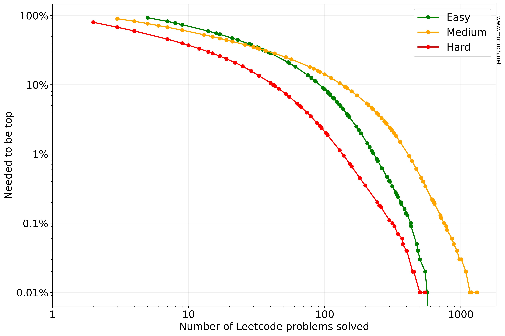

# leetcode stats

Codes that scrape Leetcode website and show how many problems you need to solve to be top 10%/1%/0.1% ...

# Codes:

leetcode_scrape.py - download necessary data from leetcode website

plot.py - plot the results

# Input:

usernames.txt - list of usernames for which to download the statistics

# Output:

results.csv - number of problems solved by the specified users and how what percentage of Leetcode users they beat in all three categories (Easy/Medium/Hard)

leetcode.jpg - plot showing dependence of "beaten by X%" on the number of solved problems
